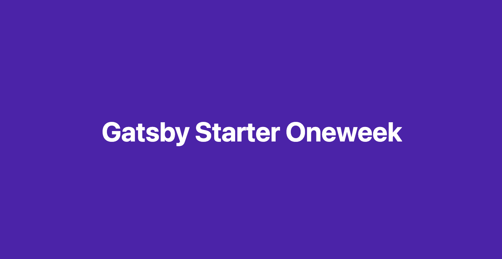

<div align="center">
  \
</div>


[한국어 버전 README🇰🇷](./README.md)

In this gatsby template...

- 💄 Code highlight with Fira Code font
- 💬 Utterances Comment feature
- ☕ 'Buy me a coffee' service
- 🤖 Google Analytics
- ⚙ Customize configure
- use TypeScript

> # We have not yet registered as a starter by Gatsby site's policy.


## Demo Site (netlify)

- [Default Theme](https://gatsby-starter-oneweek.netlify.com/)

<details>
  <summary>Use case</summary>
  <p>
    <ul>
      <li>2oneweek.dev: https://2oneweek.dev</li>
    </ul>
  </p>
</details>

> If you're using this template, Please Pull Request for `Use case`!

## 😎 Quick Start

### 1. Create a Gatsby site

```sh
# create a new Gatsby site using the blog starter
npx gatsby new my-blog-starter https://github.com/2-one-week/gatsby-starter-oneweek.git
```

> If you are not using `npx`, following [Gatsby Getting Started](https://www.gatsbyjs.org/docs/quick-start)

```sh
npm install -g gatsby-cli
gatsby new my-blog-starter https://github.com/2-one-week/gatsby-starter-oneweek.git
```

### 2. Start developing

```sh
cd my-blog-starter/
npm start
# open localhost:8000
```

### 3. Add your content

You can write...

- contents to blog in `content/blog` directory.
- resume `content/__about` directory.

> With markdown syntax and some meta data
### 4. Fix meta data

You can fix meta data of blog in `/gatsby-meta-config.js` file.

### 5. Publish with [netlify](https://netlify.com)

[](https://app.netlify.com/sites/gatsby-starter-oneweek/deploys)

:bulb: if you want to deploy github pages, add following script to package.json

```json
"scripts": {
    "deploy": "gatsby build && gh-pages -d public -b master -r 'git@github.com:${your github id}/${github page name}.github.io.git'"
}
```

## 🧐 Customize

### ⚙ Gatsby config

```sh
/root
├── gatsby-config.js // Gatsby config
├── gatsby-user-config.js // Template config by user
└── gatsby-node.js // Gatsby Node config
```

### ⛑ Structure

```sh
src
├── components // shared component with styling
├── pages // routing except post: /(home), /about, /category
├── styles
│   ├── global-style.ts // styled compoenents global styles
│   └── theme.ts // styled compoenents theme
└── containers
    ├── post.tsx
    │   ├── components // components for post containers
    │   └── index.tsx // 
    └── layout.tsx // home, post, resume layout
```

### 🎨 Style

You can customize color in `gatsby-user-config.js` file.

```sh
{
  ...
  mainColor: `color what you want`
  ...
}
```

### 🍭 Tips (You can change...)

- Profile image! (replace file in `/contents/assets/profile.png`)
- Favicon image! (replace file in `/contents/assets/favicon.png`)
- Blog site default Meta image! (replace file in `/contents/assets/default.png`)
- Utterances repository! (replace repository address in `/gatsby-user-config.js`)
  - ⚠️ Please check, this guide(<https://utteranc.es/>)

## ☕ Like it?

<a href="https://www.buymeacoffee.com/2oneweek" target="_blank">
  
</a>

## :bug: Bug reporting

[Issue](https://github.com/2-one-week/gatsby-starter-oneweek/issues)

## 🎁 Contributing

[Contributing guide](./CONTRIBUTING.md)

## Contributors

### Code Contributors

This project exists thanks to all the people who contribute. [[Contribute](CONTRIBUTING.md)].

## LICENSE

[MIT](./0BSD)

<div align="center">
  <sub>
    <sup>Project by 
      <a href="https://github.com/2-one-week">
        @2-one-week
      </a>
    </sup>
  </sub><small>✌</small>
</div>