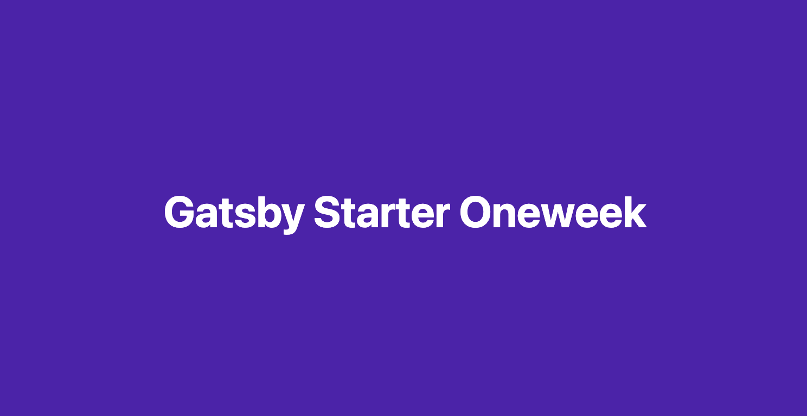

<div align="center">
  \
</div>

[](https://app.netlify.com/sites/gatsby-starter-oneweek/deploys)

[English README 🇺🇸](./README.en.md)

이 Gatsby Starter에는...

- 💄 gatsby-remark-highlight-code를 통한 커스텀한 코드 하이라이팅 기능 
- 💬 utterances 댓글 기능 지원
- ☕ 'Buy me a coffee' 라는 후원 기능
- 🤖 Google Analytics 지원
- ⚙ 별도 설정 파일을 통한 블로그 세부 사항 설정 지원
- TypeScript를 사용
- 디자인은 Velog와 한재엽님의 [gatsby-starter-bee](https://github.com/JaeYeopHan/gatsby-starter-bee)에서 영감을 받아 제작하였습니다.

> # Gatsby site의 정책에 의해 아직 starter로 등록하지 못했습니다.

## Demo 사이트 (netlify)

- [기본 테마 적용 템플릿 화면](https://gatsby-starter-oneweek.netlify.com/)

<details>
  <summary>Use case</summary>
  <p>
    <ul>
      <li>2oneweek.dev: https://2oneweek.dev</li>
    </ul>
  </p>
</details>

> 이 템플릿을 사용하여 블로그를 만들었다면 위 '사용한 블로그' 리스트에 추가해주세요! PR을 통해 등록해주시면 됩니다!

## 😎 Quick Start

### 1. Gatsby 프로젝트를 시작

```sh
# 이 블로그 스타터를 사용하여 gatsby 프로젝트를 시작할 수 있습니다.
npx gatsby new my-blog-starter https://github.com/2-one-week/gatsby-starter-oneweek.git
```

> 만약 `npx`를 사용하고 있지 않는다면, [Gatsby Getting Started](https://www.gatsbyjs.org/docs/quick-start) 글을 참고하거나 아래 커맨드를 실행해주세요.

```sh
npm install -g gatsby-cli
gatsby new my-blog-starter https://github.com/2-one-week/gatsby-starter-oneweek.git
```

### 2. Dev server를 통해 로컬에서도 접근 가능합니다.

```sh
cd my-blog-starter/
npm start
# 브라우저에서 localhost:8000로 접근 가능
```

### 3. 포스팅을 추가하세요

다음 두 곳에서 포스팅을 추가할 수 있습니다.

- 블로그 포스팅은 `content/blog` 디렉토리에 추가해주세요.
  - 폴더를 구분하면, 해당 폴더로 routing 됩니다.
- 웹에 올려둘 이력서는 `content/__about` 디렉토리에 추가해주세요.

> 몇 가지의 메타데이터와 마크다운 문법으로 포스팅을 작성할 수 있습니다.

### 4. 메타데이터 수정

`/gatsby-user-config.js` 파일에서 사용자에 따른 블로그를 설정하는 여러 요소를 수정할 수 있습니다.

### 5. [Netlify](https://netlify.com)로 배포

[](https://app.netlify.com/sites/gatsby-starter-oneweek/deploys)

:bulb: github pages를 통해 배포하고 싶다면 아래 npm script를 `package.json`에 추가해주세요.

```json
"scripts": {
    "deploy": "gatsby build && gh-pages -d public -b master -r 'git@github.com:${your github id}/${github page name}.github.io.git'"
}
```

> `gh-pages` 모듈이 필요할 경우 설치가 필요합니다.

## 사용자에 따라 바꾸기

### ⚙ 설정

```sh
/root
├── gatsby-config.js // Gatsby config
├── gatsby-user-config.js // Template config by user
└── gatsby-node.js // Gatsby Node config
```

### ⛑ 구조

```sh
src
├── components // 여러곳에서 사용하는 공통 컴포넌트들
├── pages // 기본 페이지 routing post: /(home), /about, /category
├── styles
│   ├── global-style.ts // styled compoenents에서 사용할 global style
│   └── theme.ts // styled compoenents theme
└── containers
    ├── post.tsx
    │   ├── components // post 페이지만을 위한 component들
    │   └── index.tsx // 
    └── layout.tsx // home, post, resume layout
```

### 🎨 스타일

`gatsby-user-config` 수정을 통해 main color를 바꿀 수 있습니다.

```sh
{
  ...
  mainColor: `color what you want`
  ...
}
```

### 🍭 꿀팁

- 프로필 사진! (replace file in `/contents/assets/profile.png`)
- 파비콘 이미지! (replace file in `/contents/assets/favicon.png`)
- 블로그 사이트 Default Meta 이미지! (replace file in `/contents/assets/default.png`)
- Utterances를 위한 repository를 설정해주세요! (`/gatsby-user-config.js`의 repository 주소를 교체해주세요.)
  - ⚠️ 이 [가이드](https://utteranc.es)를 꼭 확인해주세요.

## ☕ 마음에 드셨나요?

<a href="https://www.buymeacoffee.com/2oneweek" target="_blank"></a>

## :bug: 버그제보

[Issue](https://github.com/2-one-week/gatsby-starter-oneweek/issues)

## 🎁 기여하기

[Contributing guide](./CONTRIBUTING.md)

## LICENSE

[MIT](./0BSD)

<div align="center">
  <sub>
    <sup>Project by 
      <a href="https://github.com/2-one-week">
        @2-one-week
      </a>
    </sup>
  </sub>
</div>